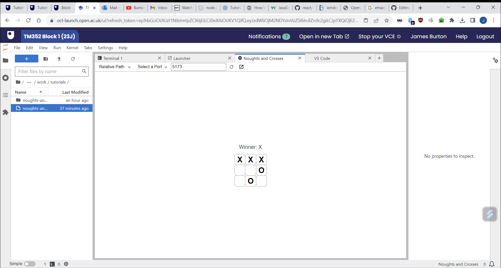
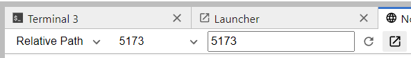
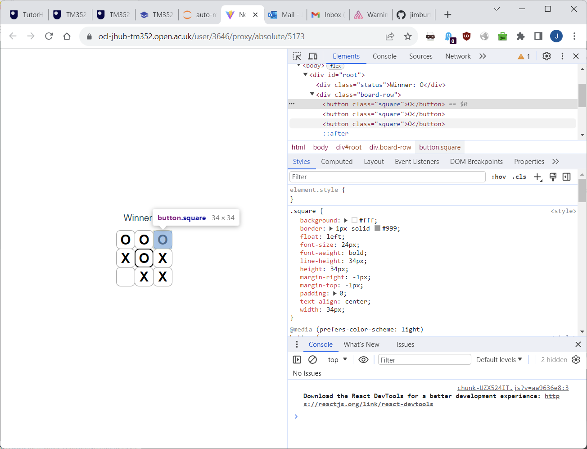
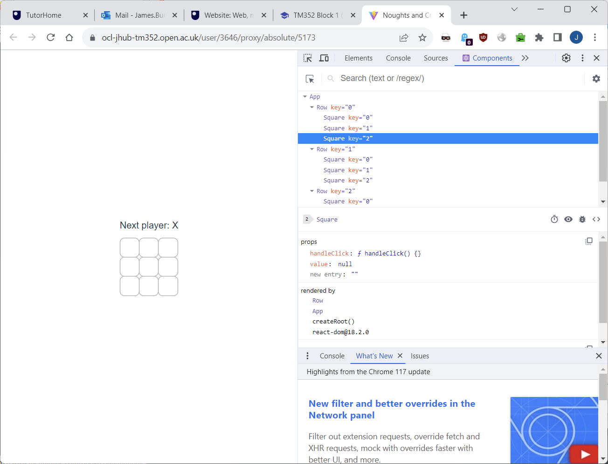

# TM325 Tutorial: Web foundations and the development environment (Overview)

This tutorial is designed to support students working on the first
parts of Block 1 in TM325. We will cover the structures behind modern
web applications and the use of the Interactive Development
Environment (IDE) in developing, deploying and testing a JavaScript
frontend application.

In particular, this tutorial will provide an overview and
demonstration of using the Open Computing Lab in development, testing
and operation of a React application. Note that the tutorial is not
designed to work on your own machine. If you wanted to do that you
could make the necessary adapatations by altering the `vite` config
file. See the practical exercise in Block 1 Part 4 for more details.

This tutorial adapts a standard React tutorial,
https://react.dev/learn/tutorial-tic-tac-toe, making a few changes to
bring the material into line with the way we are structuring and
developing React apps on TM325. Note that the original tutorial
contains extra features we won't cover, so you may want to look at the
original for more information.

We'll be developing a game of Noughts and Crosses. The finished
product looks something like this:



## Setup

1. Download a zip file of this repository from GitHub at
   https://github.com/jimburton/noughts-and-crosses-react. Alternatively,
   clone the repository and make a zip file from the parent folder.

2. Upload the zip file to the VCE. The button for doing this is in the
   upper left area of the VCE. 

3. Unzip it and move it to a convenient place. First, use the Launcher to
   open a terminal and extract the files:
   
   ```bash
   $ ou@jupyter-3646:~$ ls
   block_1  noughts-and-crosses.zip
   ou@jupyter-3646:~$ unzip noughts-and-crosses.zip 
   Archive:  noughts-and-crosses.zip
   creating: noughts-and-crosses/
   [...]
   ou@jupyter-3646:~$ 
   ```
   
   Next, move the folder to where you're keeping your work:
   
   ```bash
   ou@jupyter-3646:~$ mv noughts-and-crosses/ block_1/activities/work/frontend-frameworks
   ```

4. Build the app and run it.

   Building the app:

   ```bash
   ou@jupyter-3646:~$ cd block_1/activities/work/frontend-frameworks/noughts-and-crosses
   ou@jupyter-3646:~$ npm install
   ou@jupyter-3646:~$ npm install -D tailwindcss postcss autoprefixer
   ```
   
   To configure the app to work on the VCE you need to edit the file
   `vite.config.ts` by replacing USERID with your own user id. You can find
   your user id by looking at the entry prompt on a terminal. As you
   can see below, mine is 3646.
   
   ```bash
   ou@jupyter-3646:~$
   
   ```
   
   Go ahead and copy your own version of that value into the file
   below.
   
   ```
   // vite.config.ts
   
   import { defineConfig } from 'vite'

   import react from '@vitejs/plugin-react'

   // https://vitejs.dev/config/

   export default defineConfig({

     plugins: [react()],

     base: '/user/USERID/proxy/absolute/5173',

   })
   ```
   
   Finally, you can run the first version of the app:
   
   ```bash
   ou@jupyter-3646:~$ npm run dev
   ```

5. View the app in the browser

   Use the Launcher to open a browser. Leave the path setting to
   "Relative Path" and set the port to 5173. You should see a web page
   displaying a single square with an **X** in it.

6. Take a look at the code. Start by looking at the first file to be
   loaded, `src/main.tsx`. The `tsx` extension means that this file
   contains *Typescript XML*, i.e. a mixture of Typescript and XML
   tags. The most important thing `main.tsx` does is to load `App.tsx`
   from the same folder, so open that file next. This is where the
   front end of our app is defined.
   
   ```
   // App.tsx

   import './App.css'

   function App() {
  
    return (
      <>
      <button className="square">X</button>
      </>
    )
   }

   export default App

   ```

   As you can see, the interface to our app consists of a single
   button. Throughout the tutorial you will be making incremental
   changes to this file and adding others. If you want to jump ahead
   and see the final versions of the components for this app, you can
   find them in the `etc` directory.
   
## Constructing a board

Our board should be a 3x3 grid. One way to lay this out is by
hard-coding 9 buttons but we can avoid this repetition using a couple
of loops. Copy the code below into the `App` function, replacing the
existing call to `return` and leaving the rest of the file unchanged.

```
// in App.tsx
// ...

    return (
      <>
        {
          [0,1,2].map((i) => 
          (
            <div className="board-row">
              {[0,1,2].map((j) => (<button className="square">X</button>))}
            </div>
          ))
        }
      </>
    )
```

Check the result in the browser -- you should see a 3x3 grid of **X**
characters. What we really want is to show a blank cell to begin with,
then an **X** or a **O** depending on whose turn it is. What's more,
after the first click on a square, subsequent clicks should have no
effect.

### Breaking down the problem

We will clean things up a bit by separating the code for constructing
rows and individual squares into their own components. Create a new
file called `Square.tsx` in the `src` directory. Copy the contents
below into it:

```
// Square.tsx

function Square() {

    return <button className="square" />;
}

export default Square
```

The `Square` component constructs a single button. Now create a file
called `Row.tsx` in the `src` directory and copy the following
contents into it:

```
// Row.tsx

import Square from './Square';

function Row() {
  return (
    <>
      <div className="board-row">
        {[0,1,2].map((i) => <Square /> ) }
      </div>
    </>
  )
}

export default Row
```

The `Row` component constructs a `div` containing three `Square`
components. Finally, we will alter `App.tsx` so that it constructs
three `Row` components:

```
// App.tsx

import './App.css'
import Row from './Row';

function App() {

  return (
    <>
      {
        [0, 1, 2].map((i) => 
          (
            <Row />
          ))
      }
    </>
  )
}

export default App
```

You should now see a blank grid in the browser. In the next stage we
use *properties* and *event handlers* to implement the functionality
of the game.

## Responding to clicks on the board

We need to pass information down from the top level (the `App`
component) to the components below (`Rpw`s and `Square`s). We do this
by adding *properties* to the components. These are specified as
parameters to the function that defines the component, then we pass
actual values when writing the tags that instantiate a component.

React makes it easy to seperate the UI controls from the data they
display, the *model*. The model for our grid will be an array of 9
elements, defined at the top level. Each element will initially be
`null` then, as the game is played, can be changed to a nought or a
cross. The great thing about React is that any changes to this model
will trigger an update to the UI, so the change will be reflected
on-screen.

At the top level we define the model as a piece of *state*, then pass
a copy of it and the *row number* to each row.

```
// App.tsx

import { useState } from 'react';
import './App.css'
import Row from './Row';

function App() {

    const [squares, setSquares] = useState(Array(9).fill(null));
	
    return (
      <>
        {
          [0, 1, 2].map((i) => 
          (
            <Row rowNum={i} squares={squares.slice()} />
          ))
        }
      </>
    )
}

export default App
```

Then from within each row we will pass the right value from the model to
each square:

```
// Row.tsx

import Square from './Square';

function Row({rowNum, squares}) {
    
  const inc = rowNum*3;
  return (
    <>
      <div className="board-row">
        { [0,1,2].map((i) => <Square value={squares[inc+i]} />) }
      </div>
    </>
  )
}

export default Row
```

Finally, in the `Square` component we display the value.

```
// Square.tsx

function Square({value}) {

  return <button className="square">
           {value}
         </button>;
}

export default Square

```

We've now got the plumbing in place for reflecting changes to the
underlying data. We just need to create an event handler that will
respond to user interaction to make those changes. As with the data, we
define the handler at the top level and pass references to nested
components. We need an additional piece of state to keep track of
whether the next turn is a nought or a cross, and we call it `xIsNext`. 

```
// App.tsx

import { useState } from 'react';
import './App.css';
import Row from './Row';

function App() {

  const [xIsNext, setXIsNext] = useState(true);
  const [squares, setSquares] = useState(Array(9).fill(null));

  function handleClick(i: number) {
    // if this square has already been set, return early
    if (squares[i]) {
      return;
    }
    const nextSquares = squares.slice();
    if (xIsNext) {
      nextSquares[i] = "X";
    } else {
      nextSquares[i] = "O";
    }
    setSquares(nextSquares);
    setXIsNext(!xIsNext);
  }

    return (
      <>
        {[0,1,2].map((m) => { return <Row rowNum={m} 
                                          squares={squares}
                                          handleClick={handleClick} /> })}
      </>
    )
}

export default App

```

In the `Row` component we pass an anonymous function to each square. 

```
// Row.tsx

import Square from './Square';

function Row({rowNum, squares, handleClick}) {
  const inc = rowNum*3;
    return (
      <>
      <div className="board-row">
        { [0,1,2].map((i) => <Square value={squares[inc+i]}
                                     handleClick={() => handleClick(inc+i)} />) }
      </div>
      </>
    )
  }

  export default Row
```

And in the `Square` component we just set the `onClick` handler.

```
// Square.tsx

function Square({value, handleClick}) {

    return <button className="square" 
                   onClick={handleClick}>
                {value}
            </button>;
}

export default Square
```

Now if you click on squares on the grid you should see that the next
turn alternates between placing noughts and crosses, and after a
square is set it can't be changed. To wrap this up we just need a way
of working out when the game has been won.

## Calculating the winner

We add a function to calculate whether the game has been won. We will
add a call to this function to the function that handles click events,
and a placeholder div above the grid to contain feedback about the
progress of the game. We also need to make a change to the click
handler so that it won't make any change to the interface after the
game has been won. The final version of the `App` component is below.

```
// App.tsx

import { useState } from 'react';
import './App.css';
import Row from './Row';

function App() {

  const [xIsNext, setXIsNext] = useState(true);
  const [squares, setSquares] = useState(Array(9).fill(null));
  const winner = calculateWinner(squares);
  let status;
  if (winner) {
    status = "Winner: " + winner;
  } else {
    status = "Next player: " + (xIsNext ? "X" : "O");
  }

  function calculateWinner(squares) {
    const lines = [
      [0, 1, 2],
      [3, 4, 5],
      [6, 7, 8],
      [0, 3, 6],
      [1, 4, 7],
      [2, 5, 8],
      [0, 4, 8],
      [2, 4, 6]
    ];
    for (let i = 0; i < lines.length; i++) {
      const [a, b, c] = lines[i];
      if (squares[a] && squares[a] === squares[b] && squares[a] === squares[c]) {
        return squares[a];
      }
    }
    return null;
  }

  function handleClick(i: number) {
    if (squares[i]) {
      return;
    }
    const nextSquares = squares.slice();
    if (xIsNext) {
      nextSquares[i] = "X";
    } else {
      nextSquares[i] = "O";
    }
    setSquares(nextSquares);
    setXIsNext(!xIsNext);
  }

    return (
      <>
        <div className="status">{status}</div>
        {[0,1,2].map((m) => { return <Row mult={m} squares={squares} onRowClick={handleClick}/> })}
      </>
    )
}

export default App

```

# Debugging and testing 

## Testing manually with the Dev Tools

When thinking about testing our work, our first and most valuable
resource will be the Developer Tools built in to the browser. To get
access to these we need to open the Local Browser in its own tab,
using the toolbar icon to the right of the Path and Port controls.



Then we can access the Dev Tools through the browser menu or with the
standard Chrome shortcut `Ctrl-Shift-I`. 



The Dev Tools include:

+ an incremental debugger, allowing you to insert breakpoints in the
  code, step through it line by line and inspect any object and its
  value,
+ the Javascript console, allowing us to evaluate arbitrary
expressions, 
+ the Network tab showing all scripts and resources loaded by this
page, 
+ a profiler, allowing you to analyses the performance of your app,
  identifying the "hot spots", or sections of code that take up most
  CPU time,
+ the Element selector which allows you to inspect any DOM element on
the page, 
+ any errors that may have been found in the code, and
+ accessibility warnings and other suggestions for improving the code.

Accessing the Dev Tools should highlight two errors in the code, each
with the same message: "Warning: Each Child in a List Should Have a
Unique 'key' Prop". Note that the stack trace with each error includes
links to the source code, highlighting the line that caused the
error. When creating a list in the UI from an array with JSX or TSX,
you should add a `key` prop to each child and to any of its
children. For instance, `<li key="uniqueId1" >Item1</li>`. In two
places in the code, components were constructed after mapping over an
array but the `key` props weren't added. The keys don't need to be
globally unique, just unique among its sibling elements. 

Use the debugging information to find the source of the problems and
fix them by adding the props to the components that were produced from
an array.

The Dev Tools are a powerful suite of tools for analysing and working
on your web apps, and it's worth getting to know them. You can find
full documentation here: https://developer.chrome.com/docs/devtools.

## React Developer Tools

When building web apps with a framework such as React, what actually
gets delivered to the browser can be hard to navigate and make sense
of. The [React Developer
Tools](https://react.dev/learn/react-developer-tools) are browser
plugins that extend the Dev Tools with an understanding of React
components, props and hooks, and with the architecture of React apps.



## Automated testing

The various dev tools are most useful for manually hunting down bugs
and assisting in integration or end-to-end testing. All of the usual
techniques of automated testing are equally essential, especially the
creation and maintainance of a full suite of unit tests that can be
run at the click of button. This enables us to test individual
components, validate individual features and alert us to any
regressions (bugs which have appeared following refactoring or the
addition of new code). 

Separating the business logic from the UI and creating "mock" objects
to stand in for external services that we don't want to test (e.g. a
database or backend service that our app uses) can be a subtle
process and is beyond the scope of this tutorial.

A good place to start exploring this is with
[jest](https://jestjs.io/), a fully-featured Javascript testing
framework that has support for React.

# Further reading

That's it! If you want to extend the game, have a think about the
situation in which there is no winner. Also, the React tutorial linked
to at the beginning adds undo/redo functionality to this game, which
is an interesting demonstration of the power of binding data to a
model in React.
